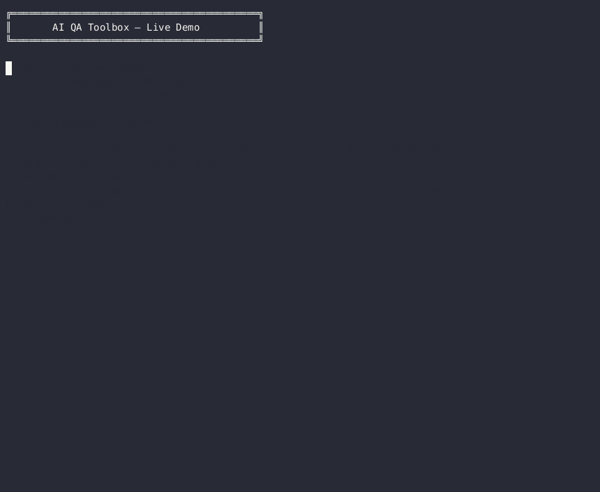

# AI QA Toolbox

> AI-powered QA automation experiments: log classification, self-healing selectors, and visual UI auditing — all driven by LLMs.



---

## Why AI?

Traditional QA tooling relies on regex patterns and pixel-diff comparisons that break the moment an app changes. LLMs handle the messy reality of QA far better:

- **Log analysis** — Stack traces are inconsistent, noisy, and non-deterministic. An LLM reads the full context, identifies root cause, and recommends action in a way no regex tree can match.
- **Selector healing** — When a locator breaks, the LLM understands element intent (a "Submit button on the checkout form") and suggests robust alternatives including Playwright-native locators.
- **Visual UX auditing** — Pixel diffs only detect *change*. Vision LLMs detect *problems*: poor contrast, broken hierarchy, inaccessible elements — even on a first run.

---

## Architecture

See [docs/architecture.md](docs/architecture.md) for the full Mermaid diagram.
URL / Log / Selector
│
▼
AI QA Toolbox
┌─────────────────────────────────────────┐
│  Log Classifier  →  ask_llm             │
│  Selector Healer →  ask_llm             │
│  UI Auditor      →  ask_llm_with_image  │
└──────────────┬──────────────────────────┘
│
▼
OpenAI API (gpt-4o)
│
▼
Structured JSON Report

---

## Quick Start

### Prerequisites
- Python 3.12+
- Docker (optional, for containerised run)
- OpenAI API key

### Install

```powershell
py -m venv .venv
.\.venv\Scripts\Activate.ps1
pip install -e ".[dev]"
python -m playwright install chromium
```

### Configure

```powershell
$env:OPENAI_API_KEY = "your-api-key"
$env:OPENAI_MODEL  = "gpt-4o-mini"   # optional, default is gpt-4o-mini
```

### Run tests

```powershell
pytest -q
```

---

## Day-by-Day Walkthrough

### Day 1 — Project scaffold
Set up the Python package, virtual environment, pyproject.toml, and base CI workflow.

### Day 2 — LLM client + screenshot service
Built `ask_llm()` wrapping the OpenAI Responses API and `take_screenshot()` using Playwright/Chromium.

### Day 3 — AI agents
Two standalone agents under `agents/`:
- **Log Classifier** — reads a Playwright failure log, returns `root_cause`, `failure_category`, `confidence`, `recommended_action`, `is_flaky`
- **Selector Healer** — takes broken locators, returns `suggested_css`, `suggested_playwright`, `reason_original_failed`

```powershell
python agents/log_classifier/main.py
python agents/selector_healer/main.py
python agents/run_all_agents.py   # run both
```

### Day 4 — Agentic UI Auditor
End-to-end visual UX pipeline: Playwright screenshot → vision LLM → structured JSON issues report.

```powershell
# CLI
python agentic-ui-auditor/auditor.py --url https://example.com

# API server
cd agentic-ui-auditor
python api.py
# POST http://localhost:8000/audit/url   body: {"url": "https://..."}
# POST http://localhost:8000/audit/upload  body: multipart file upload
```

### Day 5 — Docker + CI
Dockerised the full stack; added lint (ruff) and Docker build jobs to GitHub Actions.

```powershell
docker build -t ai-qa-toolbox .
docker run --rm -p 8000:80 -e OPENAI_API_KEY=your-key ai-qa-toolbox
```

### Day 6 — Demo + docs
Recorded terminal demo, finalised architecture diagram, and completed this README.

---

## Learning Outcomes

After exploring this project you will have seen:

- How to wrap OpenAI's Responses API for both text and vision (image) inputs
- How LLM agents outperform regex for flaky test triage
- How self-healing selector logic works end-to-end
- How Playwright integrates with an AI pipeline as a data-capture layer
- How to expose an AI pipeline as a FastAPI microservice
- How to containerise a Python + Playwright + LLM service with Docker
- How to wire Docker builds and lint checks into GitHub Actions CI

---

## Project Structure
ai-qa-toolbox/
├── ai_qa_toolbox/
│   ├── core/llm/client.py          # ask_llm + ask_llm_with_image
│   └── ui_auditor/screenshot.py    # Playwright screenshot helper
├── agents/
│   ├── log_classifier/main.py      # AI log classifier agent
│   ├── selector_healer/main.py     # AI selector healer agent
│   └── run_all_agents.py           # Unified runner
├── agentic-ui-auditor/
│   ├── auditor.py                  # CLI audit pipeline
│   └── api.py                      # FastAPI audit server
├── tests/                          # pytest suite
├── docs/
│   ├── architecture.md             # Mermaid architecture diagram
│   ├── demo_script.md              # Demo recording guide
│   └── demo.gif                    # Recorded demo (after recording)
├── Dockerfile                      # Root image
├── .dockerignore
├── requirements.txt
├── requirements-dev.txt
├── pyproject.toml
└── .github/workflows/ci.yml        # CI: test + lint + docker-build

---

## Configuration Reference

| Environment Variable | Required | Default | Description |
|---|---|---|---|
| `OPENAI_API_KEY` | Yes | — | Your OpenAI API key |
| `OPENAI_MODEL` | No | `gpt-4o-mini` | Model used for all LLM calls |

---

## License

MIT
