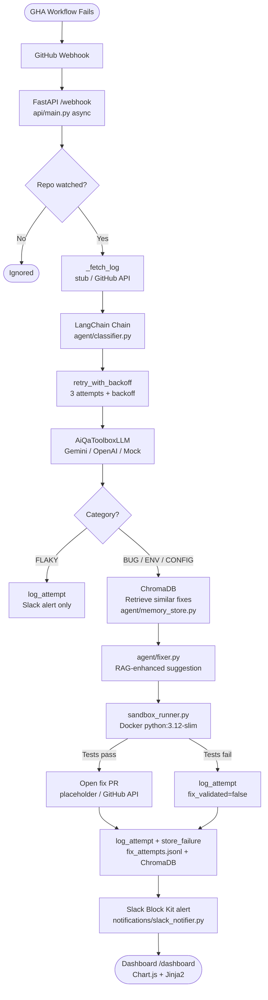
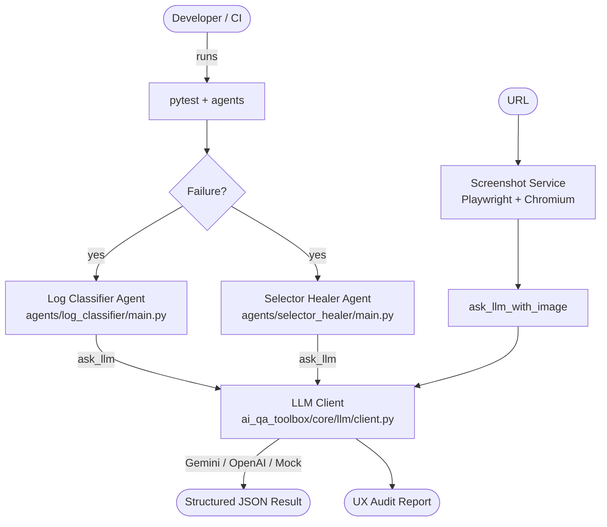

# Architecture

## Week 2 — Full Self-Healing CI Pipeline

## Week 1 — Core Infrastructure (Days 1–6)

## Component Map

| Component | Location | Day | Purpose |
|---|---|---|---|
| LLM Client | `ai_qa_toolbox/core/llm/client.py` | 2 | `ask_llm` + `ask_llm_with_image`, Gemini/OpenAI/Mock |
| Screenshot Service | `ai_qa_toolbox/ui_auditor/screenshot.py` | 2 | Playwright URL capture |
| Log Classifier Agent | `agents/log_classifier/main.py` | 3 | Standalone failure classifier |
| Selector Healer Agent | `agents/selector_healer/main.py` | 3 | Broken locator fixer |
| UI Auditor CLI | `agentic-ui-auditor/auditor.py` | 4 | Vision LLM UX audit pipeline |
| UI Auditor API | `agentic-ui-auditor/api.py` | 4 | FastAPI UX audit endpoint |
| LangChain LLM Wrapper | `agent/llm_backend.py` | 7 | BaseLLM wrapping `ask_llm()` |
| LangChain Classifier | `agent/classifier.py` | 7/12 | PromptTemplate + JsonOutputParser + retry |
| LangChain Fixer | `agent/fixer.py` | 8/9 | RAG-enhanced fix suggestion |
| ReAct Agent | `agent/react_agent.py` | 7 | Thought→Action→Observation loop |
| Sandbox Runner | `agent/sandbox_runner.py` | 8 | Docker test validation gate |
| Fix Logger | `agent/fix_logger.py` | 8 | JSONL fix attempt audit trail |
| ChromaDB Memory | `agent/memory_store.py` | 9 | Vector store for past failures |
| Seed Script | `scripts/seed_memory.py` | 9 | Bootstrap ChromaDB from JSONL |
| Repo Config | `config/loader.py` | 10 | Multi-repo watched list routing |
| Slack Notifier | `notifications/slack_notifier.py` | 10 | Block Kit CI failure alerts |
| Stats Loader | `api/stats.py` | 11 | Parses JSONL for dashboard |
| Webhook API | `api/main.py` | 8–12 | Async FastAPI pipeline orchestrator |
| Dashboard | `templates/dashboard.html` | 11 | Chart.js + activity table |
| CI Pipeline | `.github/workflows/ci.yml` | 5 | test + lint + docker-build |
| Demo GIF Workflow | `.github/workflows/demo-gif.yml` | 6 | Auto-generate demo.gif on push |
